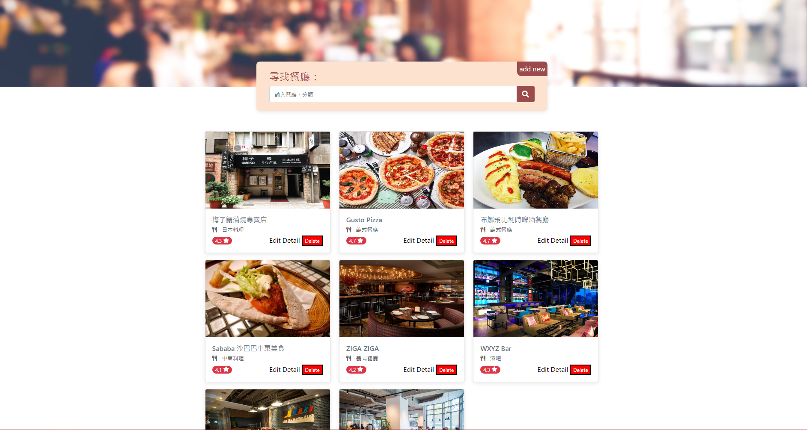

# **我的餐廳清單**

已登入資料的餐廳清單，包含各餐廳的詳細資料

&nbsp;
## **專案功能**

* 使用者可以在首頁看到所有餐廳與它們的簡單資料：
    * 餐廳照片
    * 餐廳名稱
    * 餐廳分類
    * 餐廳評分

* 使用者可以再點進去看餐廳的詳細資訊：
    * 類別
    * 地址
    * 電話
    * 描述
    * 圖片

* 使用者可以透過搜尋餐廳名稱來找到特定的餐廳

* 使用者可以透過搜尋餐廳類別來找到特定的餐廳

&nbsp;
## **環境建置與需求**

* [Node.js](https://nodejs.org/en/) - v 16.14.2
* [express](https://www.npmjs.com/package/express) - v 4.18.0
* [express-handlebars](https://www.npmjs.com/package/express-handlebars) - v 6.0.5

&nbsp;
## **安裝與執行步驟**


１.在專案資料夾中使用終端機

```properties
cd restaurant_list
```

２.安裝node套件

```properties
npm install
```

３.執行專案
> node
```properties
npm run start
```

> nodemon(視需求)

```properties
npm run dev
```

4.在瀏覽器上瀏覽專案

```
http://localhost:3000
```

專案啟動成功時，終端機輸出
```
Express is listening on http://localhost:3000
```

&nbsp;
## **專案畫面**


